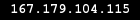

# SS/SSR 账号 

##### 本项目已被五毛盯上，IP地址会被不定期封锁。在服务器不可用期间，请下载 [一键翻墙软件](https://github.com/gfw-breaker/nogfw/blob/master/README.md?a01) 作为备用翻墙工具。

##### 免翻墙看禁闻 [禁闻聚合](https://github.com/gfw-breaker/banned-news/blob/master/README.md?a01)

##### 禁书推荐  [《九评共产党》](https://github.com/gfw-breaker/9ping.md) - [《解体党文化》](https://github.com/gfw-breaker/jtdwh.md) - [《共产主义的终极目的》](https://github.com/gfw-breaker/gczydzjmd.md)

##### SS/SSR 账号（04-20 18:00 更新IP地址及端口号）
|||
|-|-|
|IP地址||
|端口号|`443` |
|密码|`FaLunDaFaHao@513`|  
|加密|`aes-256-cfb`|
|协议(SSR) |`auth_sha1_v4`|  
|混淆(SSR) |`tls1.2_ticket_auth`|  

##### 授人以鱼不如授人以渔：搭建 [免费Web代理](https://github.com/no-gfw/heroku-node-proxy#--end--)；搭建 [免费YouTube代理](https://github.com/gfw-breaker/you2php-heroku#--end--)；免翻墙在GitHub上看禁闻 [禁闻聚合](https://github.com/gfw-breaker/banned-news/blob/master/README.md?a01)

##### 无需Linux知识、无需远程登录服务器, 在VPS上一键搭建SS/SSR, 请参考 [在Vultr上自动部署Shadowsocks](https://gfw-breaker.win/vultr%e9%83%a8%e7%bd%b2ss/) 
